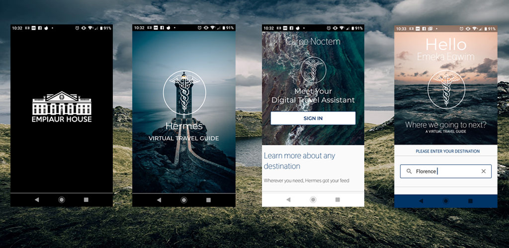

# Hermes

Hermes is a minimalist digital travel guide app that proffers end-users with supposedly relevant destination city data like local time zone, climate, currency, location photos, ITU country code and other trivial traveller insights such as places of interest. 

**Built using:** Adobe Photoshop + Illustrator, Java, Android Jetpack, Android X, AdMob, Volley, Content Provider, Flask-RESTful API, Firebase and the Material Design support library.

### Related Links

**Portfolio URL >_** https://www.emekaegwim.com/portfolios/hermes/

**Petasos API >_** https://www.emekaegwim.com/petasosapi/petasos.html 

**Google Play Store >_**

